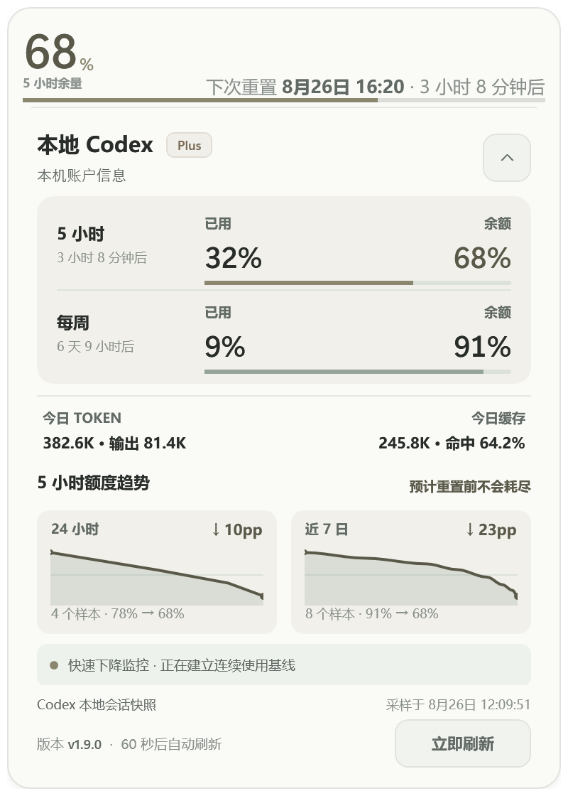

# Remaining Margin Float

一个轻量、浅色、可拖动的 Windows Codex / DeepSeek / Kimi Code 余量悬浮窗。紧凑状态只显示当前数据源最重要的数字，点击后展开账户、余额或额度、Token 统计和数据采样时间。

项目只依赖 Windows PowerShell 5.1 与 WPF。Codex 模式默认读取本地 Codex
会话中的最近余量快照并汇总 Token；用户明确启用后，才会优先从官方账户用量
接口读取周期额度。DeepSeek 模式向官方余额接口发起请求，并从 Claude Code
本地日志汇总 DeepSeek Token。Kimi Code 模式零配置，直接读取 Kimi Code CLI
的本地凭据请求官方配额接口，并从本地会话日志汇总 Kimi Token。应用不会输出
访问令牌。

目前适配`ChatGPT(Codex)、DeepSeek(Claude Code)、Kimi Code`

## 使用截图

<p align="center">
  
</p>

<p align="center"><sub>Codex 正常运行详情，使用内置脱敏演示数据。</sub></p>

## 功能

- Codex、DeepSeek 与 Kimi Code 三个数据源，可从悬浮窗或通知区域菜单切换
- 80×80 正方形紧凑悬浮窗：Codex 按套餐显示主额度（Plus 为 5 小时、Pro 为每周），Kimi Code 显示 5 小时余量百分比，DeepSeek 显示余额或预算百分比；每周额度已经用完时头部改显示每周额度（0%，标注「每周余量」）
- 可选贴边隐藏：拖到屏幕左侧或右侧后自动吸附，只保留贴边的 14px 竖向能量条触发区
- 贴边后悬停会以滑动动画展示紧凑布局，移开后自动滑回超紧凑布局
- 常规界面使用低饱和连续色阶；Codex 贴边能量条跟随套餐主额度，每周额度用完时整条变灰，数据缺失时显示灰色未知状态
- 双色进度条：鼠尾草绿表示剩余，暖米灰表示已使用
- 详情顶部使用横跨内容区的长进度条，周期标签和下次重置日期、倒计时紧贴在进度条上方
- Codex 主额度统一在顶部展示：Plus 顶部显示 5 小时额度，并以 48px 单行信息条补充每周额度；Pro 顶部显示每周额度，不再重复渲染额度卡；Plus 的每周额度用完时顶部临时改显示每周额度，重置行也跟随每周重置时间；两种套餐都保留今日 Token、输出、缓存、命中率与趋势
- 今日 Token 与今日缓存使用低对比度统计带分组，浅色容器和中间细分隔线减少与上下额度、趋势区域的视觉混淆
- 点击展开 400px 宽详情；Plus 高 522px，Pro 高 474px，收起后恢复原始位置
- 详情展开后点击桌面或切换到其他应用会自动收起
- 展开时自动避让当前显示器边界；跨显示器、DPI 缩放或任务栏工作区变化后会重新校准贴边位置
- 每 1 分钟自动刷新，支持手动刷新；每次成功刷新都会保存完整状态
- 单实例运行，重复启动会唤醒已有窗口
- 不出现在 `Win+Tab` / `Alt+Tab`，通过任务栏通知区域图标访问
- 鼠标悬浮光效、拖动、键盘快捷键和系统减少动画设置
- 托盘与悬浮窗右键菜单可同步开关贴边隐藏
- 可选择计划任务、注册表或启动文件夹三种开机启动方式
- Codex 余量采用双通道：默认读取本地会话；用户明确启用官方接口后优先使用官方数据，网络不可用时回退到本地快照；5 小时与每周窗口按实际时长识别，不依赖接口中的主次顺序
- 官方接口在后台异步刷新，不会阻塞悬浮窗；Plus 的 5 小时窗口缺失时明确显示“5 小时余量未知”，每周窗口用完时顶部改显示每周额度，Pro 则直接使用每周窗口
- 接口失败时明确显示上次成功数据的采样年龄与失败原因，不把回退数据重复写入历史或用于提醒判断
- Codex、DeepSeek 与 Kimi Code 对限流、超时和服务端暂时错误使用一致的有界退避重试（上限 30 秒，尊重 `Retry-After`）
- Kimi Code 与 Codex 共用双周期额度布局：5 小时窗口为主额度、每周配额为补充；5 小时窗口在空闲或刚重置时从 `usages.limit_5h` 摘要继续显示，不会退化为未知；官方接口失败时沿用上次成功数据，过期后显示“余量未知”，不伪装 0%
- 从 Kimi Code 本地会话日志汇总今日 Token、最近一轮用量与缓存命中率；401 时提示重新登录 Kimi Code CLI
- 读取 DeepSeek 官方余额、赠金和充值余额
- 从 Claude Code 本地日志去重统计 DeepSeek 今日与本月累计 Token；未变化的日志直接复用聚合缓存
- 按 DeepSeek 官方余额的真实变化统计今日花费与本月花费：充值只抬高基线、不计入也不冲抵花费，应用未运行时跨日的余额变化会标注“含断档”
- DeepSeek API Key 使用 Windows DPAPI 当前用户加密
- 位置、贴边状态、置顶偏好、当前数据源和全部提醒设置自动保存在本机；提醒设置按数据源分开保存，每个数据源各自一套低余量阈值与快速下降阈值
- 本地记录脱敏余量样本；Codex 的趋势跟随套餐主额度，低余量提醒与快速下降提醒按 5 小时/每周周期分别判断，样本同样按周期隔离；Kimi Code 同样支持趋势与两类提醒
- 使用历史跨重启和版本更新持久化，并按本地日期、时区和 UTC 偏移校准
- 完整页面状态跨重启和版本更新续接，滚动保留 168 小时；相同内容只保存一份，采集时间节点独立保留
- 可导出或导入合并脱敏使用记录，便于备份、换机和恢复
- “数据与诊断”提供 Provider 健康状态、脱敏运行日志及可复制、可导出的诊断报告
- 根据最近下降速度预测预计耗尽时间；Codex 会同时考虑额度重置时间
- 余量首次降到用户设定的阈值时通过通知区域提醒；默认 20%，可在右键菜单调整或关闭
- 可自定义“短时间快速下降”提醒的时间范围和阈值：Codex 与 Kimi Code 按百分比点，DeepSeek 可选百分比点或具体金额
- 详情底部显示当前软件版本；版本号保留数字字体，并与中文状态文字按同一基线对齐
- 启动后后台检查 GitHub 最新正式版，也可从悬浮窗或托盘的“软件更新”菜单手动检查
- 安装版可由用户明确启用“自动更新并重启”；仅在 Windows 判定为非计费、非漫游且未受流量限制的网络上执行
- 更新安装程序只接受本仓库 Release 中符合版本命名的资产，并核对文件大小、SHA-256 与内嵌版本
- 自动更新默认关闭；当前发布物未配置可信代码签名，启用前会明确提示风险，手动更新仍不会自动运行未签名安装程序

## 系统要求

- Windows 10 或 Windows 11
- Windows PowerShell 5.1
- Codex 模式：已运行过至少一次 Codex 任务
- DeepSeek 模式：DeepSeek API Key；本地 Token 统计需要运行过 Claude Code + DeepSeek
- Kimi Code 模式：已安装并登录 Kimi Code CLI，无需在应用内填写任何密钥

无需安装第三方模块或运行时。

## 快速开始

1. 从 GitHub Release 下载 `Remaining-Margin-Float-v*-Setup.exe`。
2. 运行安装程序，选择安装位置；安装程序会创建开始菜单入口，并可选创建桌面
   快捷方式。源码用户也可以克隆仓库后双击 `Start-RemainingMarginFloat.cmd`。
3. 点击悬浮窗查看详情，按住左键拖动位置。

也可以从 PowerShell 启动：

```powershell
powershell.exe -NoProfile -STA -File .\src\RemainingMarginFloat.ps1
```

重复执行启动命令不会创建第二个窗口，而是将正在运行的窗口带到前台。

`Start-RemainingMarginFloat.cmd` 是透明的本地启动入口，不隐藏窗口，也不绕过
PowerShell 执行策略。它会优先异步启动 `dist` 中与 `VERSION` 匹配的打包版，
没有打包版时才在当前命令窗口运行源码，并显示明确状态。面向普通用户建议
直接使用 Release 安装程序。

## 打包

在项目根目录运行：

```powershell
powershell.exe -NoProfile -File .\Build-Package.ps1 -SkipArchive
powershell.exe -NoProfile -File .\Test-Responsiveness.ps1
powershell.exe -NoProfile -File .\Build-Installer.ps1
powershell.exe -NoProfile -File .\Test-Installer.ps1
```

`Build-Package.ps1` 会在 `dist` 中生成透明的安装输入目录，包含启动器、可
审查的 PowerShell 脚本、使用说明、MIT 许可证和隐私说明。启动器运行前会验证脚本
SHA-256，并在自身进程中
托管 PowerShell；不会释放内嵌脚本、创建隐藏的 `powershell.exe` 子进程或使用
`ExecutionPolicy Bypass`。

`Test-Responsiveness.ps1` 会启动隔离的打包实例并持续约 75 秒，实际验证展开、
收起、自动刷新、后台历史补录和关闭期间的界面响应；发布前应至少运行一次。

`Build-Installer.ps1` 使用 Inno Setup 6/7 命令行编译器生成支持选择安装位置、
覆盖升级、开始菜单、可选桌面快捷方式和标准卸载流程的安装程序。CI 会从 Inno
Setup 官方不可变 GitHub Release 获取编译器，并在使用前验证其 Authenticode
发布者；普通用户无需安装 Inno Setup。

发布文件示例：

```text
Remaining-Margin-Float-v1.11.1-Setup.exe
Remaining-Margin-Float-v1.11.1-Setup.exe.sha256
```

本版本的用户可见更新内容见 [RELEASE_NOTES.md](RELEASE_NOTES.md)。

推送与 `VERSION` 一致的标签（例如 `v1.11.1`）后，`Windows 发布`工作流会
在 Windows Runner 上测试、构建，并真实执行静默安装与卸载验证，随后创建或更新
GitHub Release。手动运行该工作流时只生成 Actions Artifact，不创建 Release。

当前项目的应用与安装程序尚未进行商业代码签名。安全报告方式见
[SECURITY.md](SECURITY.md)。

## 源码结构

运行入口是 `src\RemainingMarginFloat.ps1`，它按照 `src\Components.psd1`
声明的顺序加载同一脚本作用域中的组件。Provider、基础设施、诊断与 UI 已分别
放在对应目录，主窗口布局位于 `src\UI\MainWindow.xaml`。

为了保持安装内容简单且可审查，构建时会按照同一组件清单把源码和 XAML
合并为安装目录内的单个 `RemainingMarginFloat.ps1`。源码模式与打包模式因此执行
同一组组件，同时发布启动器仍只需要验证一个脚本的 SHA-256。

组件职责、Provider 快照契约和维护约束见
[ARCHITECTURE.md](ARCHITECTURE.md)。

## DeepSeek 配置

1. 在悬浮窗或通知区域右键菜单的“数据源”中选择 DeepSeek。
2. 首次切换会自动打开设置窗口；切换成功后，右键菜单才显示“DeepSeek 设置…”。
3. 输入 DeepSeek API Key。
4. 可选填写“预算基准”；设置后小窗显示当前余额相对该金额的百分比，留空则直接显示金额。

也可以通过 `DEEPSEEK_API_KEY` 环境变量提供密钥；环境变量优先于本地加密配置。DeepSeek 模式不依赖 CC Switch。

## Kimi Code 配置

Kimi Code 模式默认零配置：应用优先自动读取本机 Kimi Code CLI 的凭据（OAuth
访问令牌或 `config.toml` 中的 `api_key`）请求官方配额接口，只需在“数据源”
中选择 Kimi Code 即可；重新登录 Kimi Code CLI 后，应用会在下一次刷新时自动
使用新凭据。

自动读取不可用时可以手动配置备用：在悬浮窗或通知区域右键菜单中选择
“Kimi Code 手动配置…”（Kimi Code 为当前数据源时才显示），输入 Kimi
API Key。这适合没有安装 Kimi Code CLI、但把 Kimi 接入了其他工具（如
Codex）的用户。手动 Key 通过 Windows DPAPI `CurrentUser` 加密后保存在本机；
配置窗口会同时显示当前的自动检测结果，也可以勾选“清除手动配置的 API Key”
恢复为仅自动读取。切换到 Kimi Code 数据源时如果完全检测不到凭证，会自动
打开该窗口；保存手动配置后自动刷新，账号行会注明凭证来源（Kimi Code
CLI（OAuth 登录）/ Kimi Code CLI（config.toml）/ 手动配置）。

## 操作

| 操作 | 结果 |
|---|---|
| 单击悬浮窗 | 展开或收起详情 |
| 详情展开后点击桌面或其他应用 | 自动恢复紧凑悬浮窗 |
| 按住左键拖动 | 移动紧凑悬浮窗 |
| 拖到屏幕左侧或右侧 | 开启“贴边隐藏”时自动吸附并收为竖向能量条 |
| 悬停贴边能量条 | 快速滑出紧凑布局；鼠标移开后自动收回 |
| 按住贴边能量条向屏幕内拖动 | 移动 4px 即取消贴边，不会被普通吸附区重新拉回 |
| 鼠标右键 | 打开刷新、数据源、数据与诊断、贴边隐藏、开机启动、置顶和退出菜单；DeepSeek 为当前数据源时才显示其设置 |
| `Esc` | 收起详情 |
| `Ctrl+R` | 立即刷新 |
| 详情右上角箭头 | 收起详情 |
| 单击通知区域图标 | 唤醒窗口并打开详情 |
| 右键通知区域图标 | 打开详情、切换数据源、设置贴边隐藏或开机启动、置顶或退出；DeepSeek 模式下可配置 DeepSeek |

## 数据与隐私

应用读取以下本地文件：

- `%USERPROFILE%\.codex\sessions\**\*.jsonl`
- `%USERPROFILE%\.codex\auth.json`（仅在用户明确启用 Codex 官方接口后）
- `%USERPROFILE%\.claude\projects\**\*.jsonl`
- `%USERPROFILE%\.kimi-code\credentials\*.json` 与 `%USERPROFILE%\.kimi-code\config.toml`（仅 Kimi Code 模式，只读登录凭据）
- `%USERPROFILE%\.kimi-code\sessions\**\agents\main\wire.jsonl`（仅 Kimi Code 模式，汇总 Token）

会话文件用于汇总 Codex Token，并提供最近一次本地可见的周期余量快照。
Codex 官方接口访问默认关闭；用户在右键菜单中明确启用后，认证文件才会在
内存中读取账户标识、访问令牌以及 ID Token 的显示名称和邮箱声明。账户标识
和访问令牌仅用于请求 `https://chatgpt.com/backend-api/wham/usage`，不会写入
日志或界面，刷新令牌不会被应用使用。完整说明见 [PRIVACY.md](PRIVACY.md)。

Codex 详情中的今日 Token、输入、输出和缓存均按本机当天可见会话汇总；不把任意一个并行任务的最后一轮数据当作全局状态。

DeepSeek 模式每 1 分钟最多请求一次官方 `https://api.deepseek.com/user/balance`。API Key 优先从 `DEEPSEEK_API_KEY` 读取；通过设置窗口保存时，使用 Windows DPAPI `CurrentUser` 加密后写入 `%LOCALAPPDATA%\RemainingMarginFloat\deepseek.json`。首次运行新命名版本时会从旧的 `%LOCALAPPDATA%\CodexMarginFloat` 复制现有配置。应用不读取 CC Switch 密钥或数据库。

Kimi Code 模式每 1 分钟最多请求一次官方配额接口 `{base_url}/usages`（默认 `https://api.kimi.com/coding/v1`，国际区为 `https://api.kimi.ai/coding/v1`），官方接口另有 15 秒快缓存。应用只读使用 Kimi Code CLI 本地的 OAuth 访问令牌或 `config.toml` 中的 API Key 作为 Bearer 凭证，不刷新令牌，也不会把凭据写入应用设置、日志或历史；设置 `KIMI_CODE_HOME` 环境变量时以该目录为准。本地 Token 统计来自 Kimi Code 会话日志 `wire.jsonl` 中的 `usage.record` 记录，并跳过子代理目录。

DeepSeek 公开余额接口不提供 Codex 式周期重置数据。未设置预算基准时，小窗直接显示货币余额，不推导虚假的百分比。

DeepSeek 的“今日花费”和“本月花费”来自官方余额接口的真实余额变化，不再使用本地日志价格估算。充值或赠送额度只会抬高计算基线，不计入花费、也不会冲抵已花费金额。统计只覆盖应用实际运行期间观测到的余额变化；应用未运行时发生的下降如果跨过了本地午夜，无法判断属于哪一天，会被计入当月但不会计入“今日花费”，此时卡片会标注“含断档”。首次启用该功能时会用现有 7 天趋势历史回填，因此“本月花费”的起始日期以卡片副标题标注的覆盖起点为准。账户级精确账单仍请在 DeepSeek Platform 的 Usage 页面按月导出。

每次手动或自动刷新成功后，应用还会把完整页面快照保存到
`%LOCALAPPDATA%\RemainingMarginFloat\state-history`；退出时会补存最近一次
有效状态，启动时优先恢复当前数据源的最后有效快照，再继续正常刷新。记录严格
保留最近 168 小时，每个采集时间节点单独保存；内容完全相同时通过 SHA-256
引用同一份数据。完整内容使用 Windows DPAPI `CurrentUser` 加密，索引只包含
时间、数据源、应用版本和内容哈希。状态仓库不保存 API Key、访问令牌、刷新
令牌、Authorization 或密码字段，也不会通过“数据与诊断”导出。时间节点按天追加到
小型 JSONL 分片，最新状态使用独立的小索引；刷新和退出不再重写整个 168 小时历史。

花费台账保存在
`%LOCALAPPDATA%\RemainingMarginFloat\spend-ledger.json`，按数据源保存最近一次
观测到的余额、最近的观测时间，以及按本地日期分桶的已花费金额、充值金额、样本数、
最大观测间隔与两类断档金额，只保留当前月与上一个月。它不包含账号名称、邮箱、
Token、API Key 或访问令牌，也不会通过“数据与诊断”导出。趋势历史只保留 7 天，
不足以回答“本月花了多少”，因此月份统计来自这份台账而不是趋势历史。

趋势历史保存在
`%LOCALAPPDATA%\RemainingMarginFloat\usage-history.jsonl`，只包含数据源、
采样 UTC、本地日期、时区、百分比或余额、额度周期、币种和可选的重置时间。每次成功刷新
（包括每分钟自动刷新和手动刷新）都会追加样本，并保留最近 8 个本地日历日；
DeepSeek 设置预算后会同时保留百分比与余额样本，以支持两种快速下降规则。记录不写入账号名称、邮箱、Token、API Key
或访问令牌。右键菜单“数据与诊断”可导出或导入合并同一脱敏格式；换机导入后
会依据目标电脑时区重新校准日期。Codex 1.9.0 起按 `FiveHour` 或 `Weekly`
隔离趋势和提醒；v1/v2 历史中的 Codex 百分比样本会按升级前语义自动识别为
`Weekly`，因此 Pro / Pro Lite 覆盖安装或重新安装后仍能继续显示原有趋势，且不会
混入 Plus 的 5 小时趋势。每周额度用完时头部改显示每周额度只影响展示，样本周期
与提醒作用域仍取套餐主周期。提醒设置从 1.11.2 起按数据源分开保存在
`settings.json` 的 `AlertSettings` 节点下；旧版本的平铺字段会被迁移为三个数据源
的初始值，并继续按当前数据源写入，便于回退到旧版本。

运行日志保存在
`%LOCALAPPDATA%\RemainingMarginFloat\logs\runtime.log`，记录启动、刷新、窗口状态切换、历史写入和关闭耗时及异常。日志为 JSONL，单文件最大 2 MB，最多保留 4 个备份；凭据、邮箱和用户路径会在写入前脱敏。可从托盘右键菜单的“数据与诊断 → 打开运行日志目录”直接查看。

## 常见问题

### 显示“等待数据”

应用默认只读取本地 Codex 会话。若显示“余量未知”，请确认本机至少运行过
一次包含余量信息的 Codex 任务。若希望获得最新官方数据，请在右键菜单中明确
启用“Codex 官方接口（读取登录凭据）”，并确认 Codex 已登录且网络可以访问
ChatGPT。

### DeepSeek 显示“等待配置”

先在“数据源”中切换到 DeepSeek，再通过自动打开的设置窗口填写 API Key；之后右键菜单会持续显示“DeepSeek 设置…”。也可以在启动程序前设置 `DEEPSEEK_API_KEY`。HTTP 401 表示密钥无效，需要重新配置。

### Kimi Code 显示“等待登录”或“余量未知”

“等待登录”表示应用未找到 Kimi Code CLI 的本地凭据，或凭据已失效（官方
配额接口返回 401）；请先运行并登录 Kimi Code CLI，应用会在下一次刷新时
自动使用新凭据。“余量未知”表示官方接口暂时不可用且本地没有可用的历史
数据；限流（429）、服务端错误和超时会自动按有界退避重试，期间沿用上次
成功数据并标明采样时间，恢复后自动更新。

### 为什么暂时没有耗尽预测

预测至少需要 3 个样本并覆盖 30 分钟。刚启用时会显示“积累 30 分钟后预测”；
检测到 Codex 额度重置或 DeepSeek 充值后，会从新的下降段重新计算。

### 如何调整提醒

在悬浮窗或通知区域图标的右键菜单中选择“提醒设置…”，可以分别启用或关闭
低余量与快速下降提醒。低余量阈值为 1–99 的整数百分比；快速下降可设置
5–1440 分钟时间范围，Codex 使用下降的百分比点，DeepSeek 可选择百分比点或
具体金额。DeepSeek 的百分比规则需要先设置预算基准，金额规则无需预算。
所有阈值、模式和开关都会保存在本机，重启后继续生效。

### DeepSeek 没有显示百分比

这是预期行为。余额本身没有自然的百分比分母；填写预算基准后才会显示百分比和双色进度。

### 双击启动脚本后没有第二个窗口

这是预期行为。项目采用单实例运行，第二次启动会唤醒已有窗口。

### 在任务栏中找不到图标

图标位于 Windows 任务栏右侧的通知区域，不是普通任务栏按钮。若未直接显示，请点击通知区域的 `^` 展开折叠图标。

### 展开窗口靠近屏幕边缘

应用会在当前显示器的工作区域内调整详情位置。收起后，小窗会回到展开前的位置。

### 如何设置开机启动

在悬浮窗或通知区域图标的右键菜单中打开“设置开机启动”，可选择：

- 计划任务（推荐）：当前用户登录后启动，支持延迟补启且不需要管理员权限
- 注册表（兼容）：写入当前用户的 `Run` 项
- 启动文件夹（备用）：创建当前用户的启动快捷方式

应用会确保同一时间只保留一种启动方式。选择“关闭”会移除上述三种注册。

Windows 服务运行在隔离的 Session 0 中，无法向当前用户桌面显示 WPF 悬浮窗，因此菜单会明确显示该方式不适用并保持禁用。

### Windows 阻止脚本执行

面向普通用户请使用 Release 中的安装程序。源码启动入口
不会绕过本机执行策略；如果组织策略禁止运行本地脚本，请不要降低系统安全
设置，也不要通过关闭安全软件或添加全局白名单绕过限制。

### Windows 显示“未知发布者”或安全软件报风险

当前 Release 未进行代码签名，因此安装程序可能显示“未知发布者”，安全软件
也可能提示风险。只从本仓库的 GitHub Release 下载；应用内更新会核对
Release 路径、文件大小、配套 SHA-256 和内嵌版本。手动更新不会自动运行
未签名安装程序；只有用户明确启用自动更新并接受警告后，安装版才会在合适
网络上静默运行已校验的安装程序。手动下载时也应核对 SHA-256。如果文件
哈希不一致，请勿运行，也不要通过关闭安全软件或添加全局白名单绕过提示。

## 许可证

本项目采用 [MIT License](LICENSE) 开源。版权和许可声明请参见仓库根目录的 `LICENSE` 文件。
