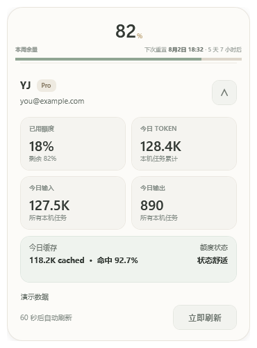
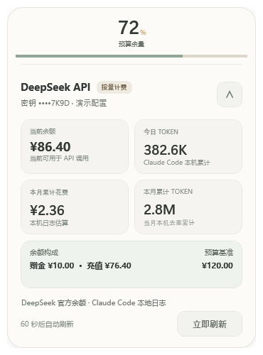

# Codex Margin Float

一个轻量、浅色、可拖动的 Windows Codex / DeepSeek 余量悬浮窗。紧凑状态只显示当前数据源最重要的数字，点击后展开账户、余额或额度、Token 统计和数据采样时间。

项目只依赖 Windows PowerShell 5.1 与 WPF。Codex 模式只读取本机会话快照；DeepSeek 模式只向官方余额接口发起请求，并从 Claude Code 本地日志汇总 DeepSeek Token。应用不会输出访问令牌。

<p align="center">
  
  &nbsp;&nbsp;&nbsp;
  
</p>

<p align="center">
  
  &nbsp;&nbsp;&nbsp;
  
</p>

## 功能

- Codex 与 DeepSeek 双数据源，可从悬浮窗或通知区域菜单切换
- 108×100 紧凑悬浮窗：Codex 显示周期余量，DeepSeek 显示余额或预算百分比
- 双色进度条：鼠尾草绿表示剩余，暖米灰表示已使用
- 点击展开 370×500 详情，收起后恢复原始位置
- 详情展开后点击桌面或切换到其他应用会自动收起
- 展开时自动避让当前显示器边界
- 每 60 秒刷新，支持手动刷新
- 单实例运行，重复启动会唤醒已有窗口
- 不出现在 `Win+Tab` / `Alt+Tab`，通过任务栏通知区域图标访问
- 鼠标悬浮光效、拖动、键盘快捷键和系统减少动画设置
- 本地解析 Codex 会话中的余量、重置时间和 Token 数据
- 读取 DeepSeek 官方余额、赠金和充值余额
- 从 Claude Code 本地日志去重统计 DeepSeek 今日与本月累计 Token
- 按 DeepSeek V4 官方人民币价格估算本机本月累计花费
- DeepSeek API Key 使用 Windows DPAPI 当前用户加密
- 位置、置顶偏好和当前数据源自动保存在本机

## 系统要求

- Windows 10 或 Windows 11
- Windows PowerShell 5.1
- Codex 模式：已运行过至少一次 Codex 任务
- DeepSeek 模式：DeepSeek API Key；本地 Token 统计需要运行过 Claude Code + DeepSeek

无需安装第三方模块或运行时。

## 快速开始

1. 下载或克隆仓库。
2. 双击 `Start-CodexMarginFloat.cmd`。
3. 点击悬浮窗查看详情，按住左键拖动位置。

也可以从 PowerShell 启动：

```powershell
powershell.exe -NoProfile -ExecutionPolicy Bypass -STA -File .\src\CodexMarginFloat.ps1
```

重复执行启动命令不会创建第二个窗口，而是将正在运行的窗口带到前台。

## DeepSeek 配置

1. 右键悬浮窗或通知区域图标，选择“DeepSeek 设置…”。
2. 输入 DeepSeek API Key。
3. 可选填写“预算基准”；设置后小窗显示当前余额相对该金额的百分比，留空则直接显示金额。
4. 在“数据源”菜单选择 DeepSeek。

也可以通过 `DEEPSEEK_API_KEY` 环境变量提供密钥；环境变量优先于本地加密配置。DeepSeek 模式不依赖 CC Switch。

## 操作

| 操作 | 结果 |
|---|---|
| 单击悬浮窗 | 展开或收起详情 |
| 详情展开后点击桌面或其他应用 | 自动恢复紧凑悬浮窗 |
| 按住左键拖动 | 移动紧凑悬浮窗 |
| 鼠标右键 | 打开刷新、数据源、DeepSeek 设置、置顶和退出菜单 |
| `Esc` | 收起详情 |
| `Ctrl+R` | 立即刷新 |
| 详情右上角箭头 | 收起详情 |
| 单击通知区域图标 | 唤醒窗口并打开详情 |
| 右键通知区域图标 | 打开详情、切换数据源、配置 DeepSeek、置顶或退出 |

## 数据与隐私

应用读取以下本地文件：

- `%USERPROFILE%\.codex\sessions\**\*.jsonl`
- `%USERPROFILE%\.codex\auth.json`
- `%USERPROFILE%\.claude\projects\**\*.jsonl`

会话文件用于读取 Codex 已记录的 `rate_limits` 和 Token 统计。认证文件只在内存中解析 ID Token 的显示名称和邮箱声明；访问令牌、刷新令牌和原始认证文件不会写入日志或界面。

当前 Codex 本地快照没有提供“剩余可重置次数”，因此界面明确显示“未提供”，不会虚构数据。

DeepSeek 模式每 60 秒最多请求一次官方 `https://api.deepseek.com/user/balance`。API Key 优先从 `DEEPSEEK_API_KEY` 读取；通过设置窗口保存时，使用 Windows DPAPI `CurrentUser` 加密后写入 `%LOCALAPPDATA%\CodexMarginFloat\deepseek.json`。应用不读取 CC Switch 密钥或数据库。

DeepSeek 公开余额接口不提供 Codex 式周期重置数据。未设置预算基准时，小窗直接显示货币余额，不推导虚假的百分比。

DeepSeek 的“本月累计花费”由本机 Claude Code 日志中的缓存命中、缓存未命中和输出 Token 按当前官方人民币价格估算，仅代表本机可见调用，不等同于 DeepSeek 账户账单。账户级精确用量请在 DeepSeek Platform 的 Usage 页面按月导出。

## 自检

```powershell
powershell.exe -NoProfile -ExecutionPolicy Bypass -File .\tests\Smoke.ps1
```

自检覆盖：

- PowerShell 语法
- Codex / DeepSeek 数据结构与数值范围
- DeepSeek DPAPI 加解密与 Claude Code 日志统计
- 剩余/已使用进度分段与 0–100 边界
- `Win+Tab` / `Alt+Tab` 隐藏状态和 32×32 通知区域图标
- 屏幕边界避让
- 普通展开与收起
- 详情失焦自动收起并恢复原始位置
- 收起过程中重新展开
- 尺寸和原始位置恢复

## 文档

- [参考手册](docs/REFERENCE.md)：命令行参数、数据字段、设置路径与窗口常量
- [架构说明](docs/ARCHITECTURE.md)：数据流、单实例机制和窗口状态设计
- [贡献指南](CONTRIBUTING.md)：开发、测试和预览流程
- [变更记录](CHANGELOG.md)：版本历史

## 常见问题

### 显示“等待数据”

先运行一次 Codex 任务，让 Codex 在本机会话目录中写入用量快照，然后点击“立即刷新”。

### DeepSeek 显示“等待配置”

通过右键菜单打开“DeepSeek 设置…”并填写 API Key，或在启动程序前设置 `DEEPSEEK_API_KEY`。HTTP 401 表示密钥无效，需要重新配置。

### DeepSeek 没有显示百分比

这是预期行为。余额本身没有自然的百分比分母；填写预算基准后才会显示百分比和双色进度。

### 双击启动脚本后没有第二个窗口

这是预期行为。项目采用单实例运行，第二次启动会唤醒已有窗口。

### 在任务栏中找不到图标

图标位于 Windows 任务栏右侧的通知区域，不是普通任务栏按钮。若未直接显示，请点击通知区域的 `^` 展开折叠图标。

### 展开窗口靠近屏幕边缘

应用会在当前显示器的工作区域内调整详情位置。收起后，小窗会回到展开前的位置。

### Windows 阻止脚本执行

推荐使用仓库中的 `Start-CodexMarginFloat.cmd`。它只为本次进程设置 `ExecutionPolicy Bypass`，不会修改系统执行策略。

## 许可证

本仓库目前没有附加开源许可证。在仓库所有者选择许可证之前，默认版权规则仍然适用。
